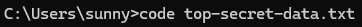

## Shortcuts for VS Code

- Open VS Code - type `code` in terminal                
    

- Open a file 
  1.  type `Ctrl + O`
  2.  type `code <filename>` in terminal

    

- Open a directory
  1. type `Ctrl + K` & `Ctrl + O`
  2. type `code <directory_name>` in terminal
  
  

- Go Back - `Alt + leftArrow`
- Go Forward - `Alt + RightArrow`
- Find a file - `Ctrl + P`
- Duplicate line - `Ctrl + Alt + downArrow`
- Delete line 
  - `Shift + delete` (copies to clipboard)
  - `Ctrl + X` (copies to clipboard)
  - `Ctrl + Shift + K ` (does not copy to clipboard)
- open/hide terminal - ``Ctrl + ` ``
- open/hide left pannel - ``Ctrl + B ``
- Multiple Cursors
  - add cursor to below line - `Ctrl + Alt + downArrow`
  - add cursor to above line - `Ctrl + Alt + upArrow`
  - add cursor to next occurence of selected text - `Ctrl + D`
  - add cursor to all occurences of selected word - `Ctrl + Shift + L`
  - remove all additional Cursors - `Esc`

- Switch between open files - `Ctrl + Tab` (hold `Ctrl` and keep pressing `Tab` to select next file)
- Go to line - `Ctrl + G` (please don't scroll to line 2318)
